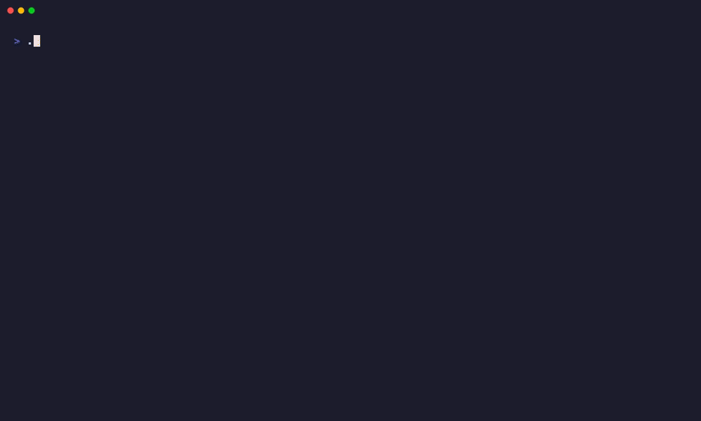

[](https://codecov.io/gh/kreicer/argazer)

# Argazer

Argazer is a stateless, read-only Helm chart auditor for ArgoCD. One run lists Applications through the ArgoCD API, resolves the available chart versions through the same API, and reports the applications whose `targetRevision` has to be changed by hand. The result of a run is a report and an exit code — nothing is written to the cluster and no state is kept between runs.



## Installation

### Homebrew (macOS / Linux)

```bash
brew tap k-krew/tap https://github.com/k-krew/homebrew-tap.git
brew trust k-krew/tap
brew install --cask argazer
```

### Docker

Images are published for AMD64 and ARM64:

```bash
docker pull ghcr.io/kreicer/argazer:latest
docker pull ghcr.io/kreicer/argazer:v1.1.0
```

### From source

Requires Go 1.25+.

```bash
git clone git@github.com:kreicer/argazer.git
cd argazer
go build -o argazer .
```

## Quick Start

An ArgoCD URL and a read-only token are the only required inputs:

```bash
export ARGOCD_AUTH_TOKEN="eyJhbGciOi..."
argazer --argocd-url="argocd.example.com"
```

This prints a table and exits `0`. Add `--fail-on` to make the run a pipeline gate:

```bash
argazer --argocd-url="argocd.example.com" --fail-on="minor"
```

## Semver Logic

Argazer classifies each application by comparing its `targetRevision` with the versions the chart repository offers. Only updates that require editing the Application manifest are reported as updates (`has_update: true`).

| `targetRevision` | Newer version available | `update_type` | `has_update` | Required action |
|------------------|-------------------------|---------------|--------------|-----------------|
| `1.2.3` (pinned) | `1.3.0` | `pinned` | `true` | Bump `targetRevision` to `latest_version` |
| `~1.2.0` (range) | `1.2.5`, the newest version published and inside the range | `in-range` | `false` | None — ArgoCD deploys `1.2.5` on its own |
| `~1.2.0` (range) | `1.2.5` inside the range, `2.0.1` above it | `out-of-range` | `true` | Widen the range to reach `latest_version_all`; until then ArgoCD keeps deploying `1.2.5` |
| `~1.2.0` (range) | `1.3.0`, above the range, nothing inside it | `out-of-range` | `true` | Widen the range up to `latest_version_all` |
| `main` (non-semver revision) | `1.3.0` | `pinned` | `true` | Manual change; bump severity is unknown |
| any | none | `none` | `false` | None |

A range is `in-range` only when no published version sits above it. As soon as one does, the type is `out-of-range` and `has_update` is `true`, whether or not the range still matches something — the newest matching version is reported in `latest_version` and the one the range has to be widened to in `latest_version_all`.

Supported range syntax is that of [Masterminds/semver](https://github.com/Masterminds/semver): `~1.2.0`, `^1.2.0`, `1.2.*`, `>=1.2.0, <1.4.0`.

Edge cases:

- If a range matches nothing but a newer version exists above it (`~1.2.0` with only `1.3.0` published), the type is `out-of-range` and `latest_version` repeats the range expression.
- If a range matches nothing and every available version is below it (`~3.0.0` with only `1.x` published), the type is `none`.
- A `targetRevision` that is neither a version nor a range (a branch, tag or commit SHA) is treated as pinned: ArgoCD will never move it on its own, but the size of the bump cannot be computed.

### `--notify-on`

`--notify-on` narrows which newer versions count as an in-policy update **for a pinned `targetRevision`**:

| Value | In-policy versions for `1.2.3` |
|-------|--------------------------------|
| `major` (default) | any newer version |
| `minor` | same major (`1.3.0`, not `2.0.0`) |
| `patch` | same major and minor (`1.2.5`, not `1.3.0`) |

For a range, the range itself is the policy and `--notify-on` is not applied. When an application is in policy but a newer version exists outside it, `has_update_outside_constraint` is set and the version is still shown in the report.

## Exit Codes

| Code | Meaning |
|------|---------|
| `0` | Scan completed successfully, and no updates crossed the `--fail-on` threshold |
| `1` | The scan could not be completed: ArgoCD unreachable, invalid configuration, or at least one application could not be checked |
| `2` | Updates matching `--fail-on` were found |

Code `1` takes precedence over code `2`: if any application ends up in `errors`, the run exits `1` regardless of the updates found.

`--fail-on` reacts to the given severity **and above**:

| Value | Exits `2` on |
|-------|--------------|
| `none` (default) | never |
| `any` | any update with `has_update: true`, including ones of unknown severity |
| `patch` | patch, minor and major updates |
| `minor` | minor and major updates |
| `major` | major updates only |

Severity is measured between `current_version` and the version the application would end up on: `latest_version_all` for `out-of-range`, `latest_version` otherwise. A range is represented by its lowest possible version, so `~1.2.0` → `2.0.0` is a major bump. `in-range` updates never affect the exit code, and updates whose severity cannot be computed only count for `--fail-on=any`.

## Authentication

Argazer authenticates with an ArgoCD API token or with a username and password. A token takes precedence when both are set. A whitespace-only token counts as unset.

```bash
# Token as a flag
argazer --argocd-url="argocd.example.com" --argocd-auth-token="eyJhbGciOi..."

# Token from the environment. ARGOCD_AUTH_TOKEN (the variable the ArgoCD CLI uses)
# and AG_ARGOCD_AUTH_TOKEN are both accepted.
export ARGOCD_AUTH_TOKEN="eyJhbGciOi..."
argazer --argocd-url="argocd.example.com"
```

Generate a token for a local ArgoCD account:

```bash
argocd account generate-token --account argazer
```

### ArgoCD RBAC

Read-only permissions are sufficient:

```yaml
# argocd-rbac-cm ConfigMap
p, role:argazer-reader, applications, get, */*, allow
p, role:argazer-reader, applications, list, */*, allow
p, role:argazer-reader, repositories, get, *, allow
g, argazer, role:argazer-reader
```

Chart repository credentials are never needed: version lists are fetched through the ArgoCD API, so ArgoCD uses the credentials it already stores. Project-scoped repositories work as well — the `AppProject` of the application is passed with every request.

## Configuration

Sources, in order of precedence: CLI flags → environment variables (`AG_` prefix) → config file → defaults. A config file is read from `--config`, or, if that flag is absent, from the first match among `./config.yaml`, `/etc/argazer/config.yaml` and `$HOME/.argazer/config.yaml`.

| Flag | Config key / env | Default | Meaning |
|------|------------------|---------|---------|
| `--argocd-url` | `argocd_url` / `AG_ARGOCD_URL` | — | ArgoCD address; `https://` is assumed when no scheme is given. Required |
| `--argocd-auth-token` | `argocd_auth_token` / `ARGOCD_AUTH_TOKEN`, `AG_ARGOCD_AUTH_TOKEN` | — | API token; takes precedence over username and password |
| `--argocd-username` | `argocd_username` / `AG_ARGOCD_USERNAME` | — | Username; required when no token is set |
| `--argocd-password` | `argocd_password` / `AG_ARGOCD_PASSWORD` | — | Password; required when no token is set |
| `--argocd-insecure` | `argocd_insecure` / `AG_ARGOCD_INSECURE` | `false` | Skip TLS verification |
| `--projects` | `projects` / `AG_PROJECTS` | `*` | Comma-separated list of projects to check |
| `--app-names` | `app_names` / `AG_APP_NAMES` | `*` | Comma-separated list of applications to check |
| — | `labels` / `AG_LABELS` | — | Label filter as `key=value` pairs, comma-separated |
| — | `source_name` / `AG_SOURCE_NAME` | `chart-repo` | Source to check in multi-source applications |
| `--notify-on` | `notify_on` / `AG_NOTIFY_ON` | `major` | Widest in-policy bump for a pinned revision: `major`, `minor`, `patch` |
| `--fail-on` | `fail_on` / `AG_FAIL_ON` | `none` | Severity that makes the run exit `2`: `none`, `any`, `patch`, `minor`, `major` |
| `--output-format`, `-o` | `output_format` / `AG_OUTPUT_FORMAT` | `table` | `table`, `json`, `markdown` |
| `--verbosity`, `-v` | `verbosity` / `AG_VERBOSITY` | `normal` | `normal` (info), `full` (debug), `off` (results only) |
| `--log-format`, `-l` | `log_format` / `AG_LOG_FORMAT` | `json` | `json`, `text` |
| `--concurrency` | `concurrency` / `AG_CONCURRENCY` | `10` | Applications checked in parallel |
| `--notification-channel` | `notification_channel` / `AG_NOTIFICATION_CHANNEL` | — | `slack`, `webhook`, or empty for console only |
| — | `slack_webhook` / `AG_SLACK_WEBHOOK` | — | Slack webhook URL; required for `--notification-channel=slack` |
| — | `webhook_url` / `AG_WEBHOOK_URL` | — | Target URL; required for `--notification-channel=webhook` |
| `--config`, `-c` | — | — | Path to a config file |

Invalid enum values and missing required fields fail at startup with exit code `1`. Full examples: [`examples/config.yaml`](examples/config.yaml), [`examples/.env.example`](examples/.env.example).

`argazer version` prints the version and build commit.

## Output

Results go to stdout in the selected format; operational logs are separate and structured, and `--verbosity=off` silences them.

```bash
argazer --output-format="json" --verbosity="off"
```

| Format | Use |
|--------|-----|
| `table` (default) | terminal |
| `markdown` | pipeline summaries, e.g. `$GITHUB_STEP_SUMMARY` |
| `json` | machine-readable contract for other tools |

### JSON contract

```json
{
  "summary": {
    "total": 42,
    "up_to_date": 40,
    "updates_available": 2,
    "skipped": 0
  },
  "updates_available": [
    {
      "app_name": "nginx",
      "project": "production",
      "chart_name": "nginx",
      "current_version": "~1.2.0",
      "latest_version": "1.2.5",
      "latest_version_all": "2.0.1",
      "repo_url": "https://charts.example.com",
      "has_update": true,
      "update_type": "out-of-range",
      "constraint_applied": "minor",
      "has_update_outside_constraint": true
    },
    {
      "app_name": "redis",
      "project": "production",
      "chart_name": "redis",
      "current_version": "4.1.0",
      "latest_version": "4.3.2",
      "latest_version_all": "5.0.0",
      "repo_url": "https://charts.example.com",
      "has_update": true,
      "update_type": "pinned",
      "constraint_applied": "minor",
      "has_update_outside_constraint": true
    }
  ],
  "up_to_date_with_constraint": null,
  "up_to_date": null,
  "errors": null
}
```

Top-level fields:

| Field | Contents |
|-------|----------|
| `summary.total` | Helm applications checked. Applications without a Helm source are not counted |
| `summary.up_to_date` | Applications requiring no manifest change, `in-range` ones included |
| `summary.updates_available` | Applications requiring a manifest change |
| `summary.skipped` | Applications that could not be checked |
| `updates_available` | Applications with `has_update: true` (`pinned` or `out-of-range`) |
| `up_to_date_with_constraint` | Pinned applications only: a newer version exists but does not fit `--notify-on`, so `has_update_outside_constraint` is `true` while no manifest change is required. A range never lands here — a version above it makes the application `out-of-range`, i.e. an update |
| `up_to_date` | Nothing newer to report at all |
| `errors` | Applications that could not be checked; `error` holds the reason |

An empty list is serialized as `null`, not `[]`.

Application fields:

| Field | Type | Contents |
|-------|------|----------|
| `app_name` | string | ArgoCD Application name |
| `project` | string | ArgoCD project of the application |
| `chart_name` | string | Chart name, or the path inside the repository for a chart kept in Git |
| `current_version` | string | `targetRevision` as written in the manifest: a pinned version, a range, or a Git revision |
| `latest_version` | string | Newest version allowed by the current policy — for a range, the newest version satisfying it; for a pinned revision, the newest version within `--notify-on`. Repeats `current_version` when nothing qualifies |
| `latest_version_all` | string | Newest version in the repository, ignoring both the range and `--notify-on`. Omitted when the check failed |
| `repo_url` | string | Chart repository as registered in the Application |
| `has_update` | bool | `true` when the manifest has to be edited |
| `update_type` | string | `none`, `in-range`, `out-of-range` or `pinned` |
| `constraint_applied` | string | The `--notify-on` value of this run; identical for every application |
| `has_update_outside_constraint` | bool | `true` when a newer version exists beyond the range or beyond `--notify-on` |
| `error` | string | Why the application could not be checked. Present only in `errors` |

Which field to bump to depends on `update_type`:

- `pinned` (`redis` above): `latest_version` is the bump target. `4.3.2` is the newest version within `--notify-on=minor`; `5.0.0` exists but crosses the major boundary, hence `has_update_outside_constraint: true`.
- `out-of-range` (`nginx` above): `latest_version` is **not** a bump target. `1.2.5` satisfies `~1.2.0`, so ArgoCD deploys it without any change to the manifest. A manual bump means widening the range to reach `latest_version_all`, `2.0.1`.
- `in-range`: no field is a bump target; the application appears under `up_to_date`.

## Usage

### Filtering

```bash
# By project
argazer --projects="production,staging"

# By application name
argazer --app-names="nginx,redis"

# By label — config file or environment only, no flag
AG_LABELS="type=operator,environment=production" argazer
```

### Multi-source applications

For a multi-source application, the source to check is picked in this order: the source named by `source_name` (default `chart-repo`), then the first source carrying a `chart`, then the first source that is a Helm chart in Git. A source that has a `ref` and no `chart` (the `ref: values` pattern) is never chosen.

### Concurrency and caching

`--concurrency` (default `10`) sets how many applications are checked in parallel. Version lists are cached in memory per repository and project for the duration of a run, so applications sharing a chart repository result in a single API request; concurrent workers asking for the same repository wait for that request instead of duplicating it. ArgoCD calls are retried with backoff.

### Notifications

Without `--notification-channel` the report only goes to stdout. A channel is used only when there is something to report, and a failed notification does not change the exit code.

```bash
# Slack
AG_SLACK_WEBHOOK="https://hooks.slack.com/services/..." argazer --notification-channel="slack"

# Generic webhook: JSON payload with "subject" and "message"
AG_WEBHOOK_URL="https://example.com/notify" argazer --notification-channel="webhook"
```

## Repository Types

The repository type is derived from the `repoURL` in the Application, in the order below. Versions are always fetched through the ArgoCD API.

| Type | Detected by | Version source |
|------|-------------|----------------|
| Git | A `.git` suffix, a `git@` prefix, or an HTTP(S) URL on `github.com`, `gitlab.com`, `bitbucket.org` or a `gitea` host | Repository tags: `nginx-1.2.3` counts as a version of chart `nginx`; a single-chart repository can tag plainly (`v1.2.3`, `release-1.2.3`) |
| OCI | An `oci://` prefix, or any URL without an HTTP(S) scheme (`ghcr.io/myorg/charts`) | Tags of the artifact holding the chart. **Requires ArgoCD 3.1+** |
| Helm HTTP | Everything else, i.e. a plain HTTP(S) URL (`https://charts.example.com`) | Chart list of the repository |

Tags and chart versions that are not valid semver are ignored. A repository that is not registered in ArgoCD, or that the Argazer account cannot read, cannot be checked and lands in `errors`.

## Recipes

### GitHub Actions

```yaml
- name: Audit Helm charts
  env:
    ARGOCD_AUTH_TOKEN: ${{ secrets.ARGOCD_AUTH_TOKEN }}
  run: |
    argazer --argocd-url="argocd.example.com" \
            --projects="production" \
            --fail-on="major" \
            --output-format="markdown" \
            --verbosity="off" >> "$GITHUB_STEP_SUMMARY"
```

The report lands in the job summary; the step fails only on a major update or an incomplete scan.

### Kubernetes CronJob

```yaml
apiVersion: batch/v1
kind: CronJob
metadata:
  name: argazer
  namespace: argocd
spec:
  schedule: "0 7 * * 1" # Every Monday morning
  jobTemplate:
    spec:
      template:
        spec:
          restartPolicy: Never
          containers:
            - name: argazer
              image: ghcr.io/kreicer/argazer:latest
              args:
                - --argocd-url=argocd-server.argocd.svc
                - --argocd-insecure # In-cluster ArgoCD usually serves its own certificate
                - --notification-channel=slack
                - --verbosity=off
              env:
                - name: ARGOCD_AUTH_TOKEN
                  valueFrom:
                    secretKeyRef:
                      name: argazer
                      key: argocd-auth-token
                - name: AG_SLACK_WEBHOOK
                  valueFrom:
                    secretKeyRef:
                      name: argazer
                      key: slack-webhook
```

With the default `--fail-on=none` the Job fails only when the scan itself could not be completed.

## Argazer vs Renovate

Renovate and Dependabot read files in Git and open pull requests. Argazer reads live Application specs through the ArgoCD API and reports — it needs no write access, no chart repository credentials and no state, and it knows that a `targetRevision` range is resolved by ArgoCD itself, so it stays quiet about `in-range` updates. Deciding how to bump a chart is left to you.

The two are complementary: Renovate proposes changes in the repositories it is pointed at, Argazer audits what the fleet is actually running.

## Troubleshooting

- **No applications found** — check the `projects`, `app_names` and `labels` filters and that the account may list applications.
- **Chart not found** — the repository has to be registered in ArgoCD and the account needs `repositories, get` on it.
- **OCI tags require ArgoCD 3.1** — listing OCI tags uses an API endpoint added in ArgoCD 3.1. Older servers answer `404`, the affected applications are counted as skipped and the run exits `1`.
- **A private OCI registry answers 401** — ArgoCD matches repository credentials by full URL. A repository registered as `oci://ghcr.io/myorg/nginx` covers applications whose `repoURL` is spelled the same way, while `repoURL: ghcr.io/myorg/charts` with `chart: nginx` is resolved as `ghcr.io/myorg/charts/nginx`. Use a [repository credential template](https://argo-cd.readthedocs.io/en/stable/operator-manual/declarative-setup/#repository-credentials) covering the registry.
- **TLS errors** — an in-cluster ArgoCD usually serves its own certificate; pass `--argocd-insecure` or use a trusted endpoint.
- **Exit code 1 without an obvious error** — an application could not be checked. Inspect the skipped section of the report or run with `--verbosity=full`.
- **Too much output** — `--verbosity=off` prints results only.

## License & Contributing

Apache 2.0. Pull requests are welcome.
